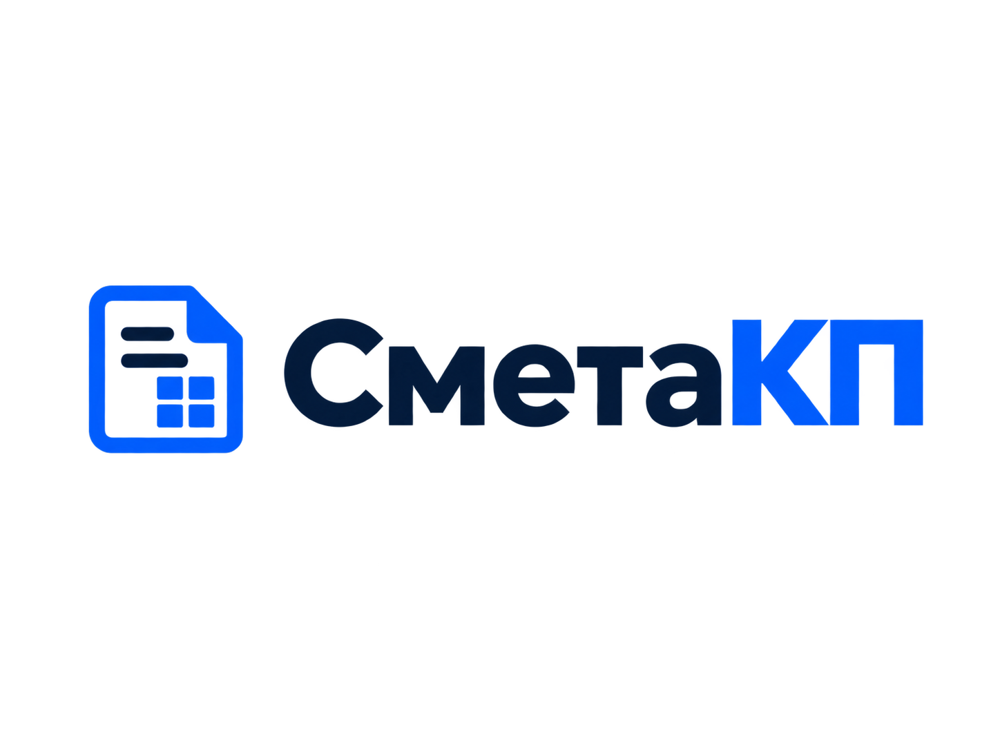
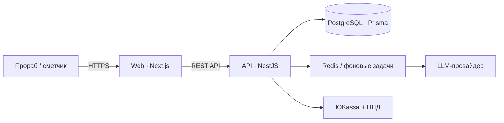

# СметаКП — showcase

> B2B-сервис для подготовки смет и коммерческих предложений из голоса или текста.

<p align="center"></p>

**Сайт:** [смета-кп.делео.рф](https://смета-кп.делео.рф)

## Задача

Прорабу или сметчику нужно быстро превратить исходные данные в понятное коммерческое предложение. Ручной процесс обычно живёт между звонками, Excel, прайс-листами и повторяющимися правками.

## Что делает продукт

- принимает описание работ голосом или текстом;
- помогает собрать смету по прайс-листу;
- формирует коммерческое предложение;
- ведёт данные организации и пользователей;
- поддерживает подписку, платежи и фискальные сценарии.

## Архитектура

[Открыть интерактивную схему](docs/architecture.html)



## Технологии

`TypeScript` · `Next.js` · `NestJS` · `PostgreSQL` · `Prisma` · `Redis` · `LLM` · `ЮKassa`

## Обезличенный пример контракта

```ts
type EstimateRequest = {
  source: 'voice' | 'text';
  workItems: string[];
};

type CommercialOffer = {
  lines: Array<{ title: string; quantity: number; price: number }>;
  total: number;
};
```

*Это схематичный публичный контракт, а не production-код или данные клиентов.*

## О репозитории

Это публичная витрина продукта. Production-код, данные клиентов, конфигурация инфраструктуры и секреты намеренно не публикуются.
